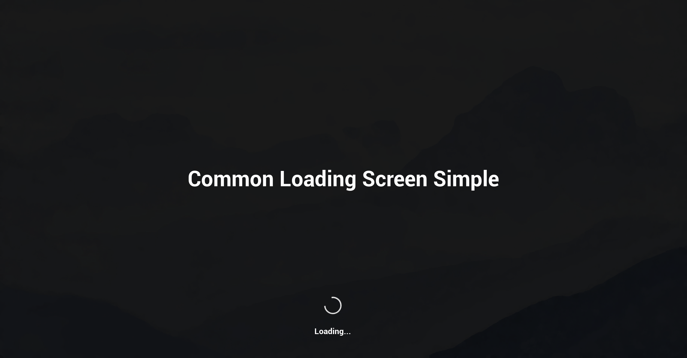

# UE5 Common Loading Screen - Basic

A standalone Unreal Engine plugin based on the Common Loading Screen system from Epic's Lyra Starter Game. This plugin strips out Lyra-specific dependencies and provides a clean, reusable loading screen solution for any UE5 project.

## Overview

The original Common Loading Screen plugin is somewhat tightly coupled to Lyra's game systems (Experience system, Developer Settings, Primary Asset pipeline) and lacks examples that work on their own. This project decouples Common Loading Screen into a standalone plugin that can be dropped into any project without Lyra as a dependency.

You can play a demo of the loading screen by downloading the latest Package (right hand menu on github).

---

## Requirements

- Unreal Engine 5.7.4 (earlier version might work but are untested)

Note: One of the major goals of this project is to have the fewest amount of dependencies as possible. It should be modular and easy to install into any project, with minimal code changes or dependencies needed.

---

## Setup

### 1. Copy the plugin

Clone or Copy the Plugins/CommonLoadingScreenBasic folder into your project's Plugins directory.

### 2. Enable the plugin

Open your project, go to Plugins and enable Common Loading Screen Basic.

### 3. Assign a loading screen widget

This is a required step. The plugin does not know what your loading screen UI should look like, so you must assign a widget class before it will display.

Go to Project Settings > Game > Common Loading Screen and assign W_LoadingScreen_Host under Loading Screen Widget.

Without this step the loading screen will fall back to a blank placeholder.

### 4. Update Game Instance
Go to Edit > Project Settings > Maps & Modes > Game Instance Class > set it to your a custom Game Instance. The default UE Game Instance doesn't appear to have persistent with bools, etc... 

Note: A custom game instance callec BP_LoadingScreenGameInstance is included in the plugin.

### 5. Place the background actor

Add BP_LobbyBackground to your frontend map. Select it and set the Background Level property in the Details panel to the world you want streamed in as the background during loading.

### 6. Place the main menu actor

Add BP_MainMenu to your frontend map. Select it in the editor and edit the Level Name property to the level you want to load when the player clicks Play. Defaults to Level001. You can easily modify the code to use your own main menu widget.

### 7. Modify Widget Blueprints

In the plugin directory, modify W_LoadingScreen_DefaultContent, W_LoadingScreen_Host, W_LoadingScreenReasonDebugText, W_Logo_LoadingScreen as well as W_MainMenu, W_SplashScreenDeveloperLogo, and W_SplashScreenUnrealEngine to suite your game. 

### 8. Configure Splash Screens

Select BP_LobbyBackground to optionally enable or disable splash screens (when the game loads), and how long they should be displayed. Included Epic's official Unreal Engine splash screen hero logo for convenience.

Replace the image in W_SplashScreenDeveloperLogo with your game company logo.

There is also an option to allow the player to skip splash screens (press spacebar). You can change the input key used to skip in BP_LobbyBackground. 

---

## How It Works

When the frontend map opens, BP_LobbyBackground fires on BeginPlay, shows the loading screen, and streams in the background sublevel. Once the sublevel is visible the loading screen hides and the main menu appears on top of the 3D background.

When the player clicks Play, BP_MainMenu calls Open Level with the configured level name. The LoadingScreenManager intercepts the map load automatically and shows the loading screen widget for the duration of the load. When the new level finishes loading the screen hides.

The LoadingProcessTask is created at runtime by the Loading Screen Manager to keep the loading screen visible during the level stream. It is not a saved asset — this is expected behavior.

---

### What Was Taken From Lyra

- CommonLoadingScreen plugin source (LoadingScreenManager, LoadingProcessTask, CommonLoadingScreenSettings, startup screen)
- LyraLobbyBackground — the actor placed in a level that triggers the loading screen and streams in a background world
- LyraDevelopmentStatics — utility functions for finding classes and PIE worlds (Lyra developer settings functions removed)
- LyraLoadingScreenSubsystem — a game instance subsystem from LyraGame/UI/Foundation that tracks the current loading screen widget class and broadcasts changes across map transitions
- Loading screen widgets (W_LoadingScreen_Host, W_LoadingScreen_Default_Content, W_LoadingScreenReasonDebugText, etc.)

### What Changed From Lyra

- Removed LyraDeveloperSettings dependency entirely
- Removed ShouldSkipDirectlyToGameplay, ShouldLoadCosmeticBackgrounds, and CanPlayerBotsAttack functions which relied on Lyra-specific editor settings
- Simplified LyraLobbyBackground to hold a soft world reference directly on the actor — no Primary Asset / Data Asset pipeline required
- Background level is set directly on the placed actor in the level via the Background Level property
- Added Allow Loading Screen function (c++) to ensure the loading screen only shows up after showing splash screens, etc, on launch
- Replaced the LYRAGAME_API macro in LyraLoadingScreenSubsystem with COMMONLOADINGSCREEN_API
- Replaced CommonTextBlock in W_LoadingScreenReasonDebugText with a standard TextBlock to remove the Common UI plugin dependency
- Plugin content reorganized into Blueprints, UI, and Examples folders
- Simplified Widget setup so it's easier to add / modify
- Added optional splash screens

---

## License

This project is based on code originally written by Epic Games, Inc. and is subject to the [Unreal Engine EULA](https://www.unrealengine.com/eula).
